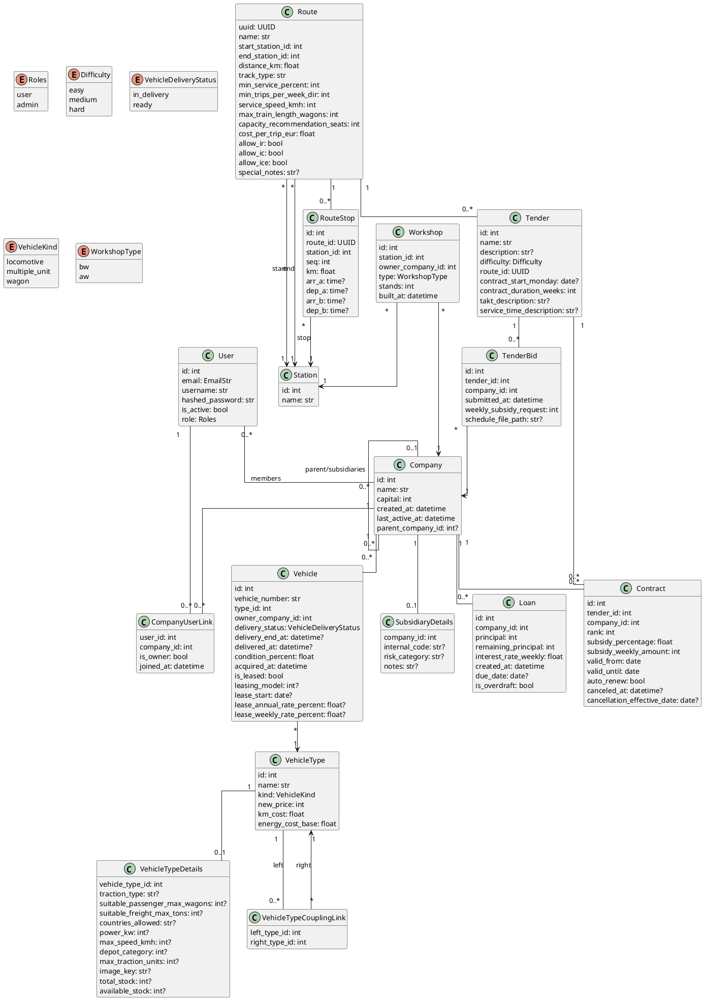

= BahnPlanNext Backend Softwaredokumentation
:toc: left
:toclevels: 4
:sectnums:
:icons: font
:source-highlighter: rouge
:rouge-style: github
:doctype: book

== Einleitung

Das Backend von *BahnPlanNext* bildet die serverseitige Logik des Spiels bzw. der Anwendung.
Es stellt eine REST-API auf Basis von FastAPI bereit und verwaltet:

- Benutzerkonten und Authentifizierung
- Gesellschaften (Companies)
- Fahrzeuge und Leasing
- Trassen (Routes)
- Ausschreibungen (Tenders)
- Werkstätten
- Finanzlogik
- Demo- und Stammdaten-Seeding

Technologisch basiert das System auf:

- FastAPI
- SQLModel (SQLAlchemy + Pydantic)
- PostgreSQL
- JWT-Authentifizierung
- SMTP-Mailversand
- dotenv

Das Backend folgt einer klaren Schichtenarchitektur:

[cols="1,3"]
|===
|Schicht |Beschreibung

|Router
|Definiert REST-Endpunkte und HTTP-Logik

|Service
|Enthält Geschäftslogik und Validierung

|Model
|Datenbank-Entitäten (SQLModel)

|Schema
|Pydantic DTOs für Request/Response

|Core
|App-Konfiguration, DB, Auth, Seeding
|===

== Systemarchitektur

=== Anwendungsstart (main.py)

Beim Start der Anwendung wird:

1. Die Datenbank initialisiert
2. Optional Demo-Daten geladen
3. CORS konfiguriert
4. Alle Router registriert

[source,python]
----
lifespan(app: FastAPI)
----

Startup:

- database.create_db_and_tables()
- Falls `SEED_DEMO_DATA=true`: seed_demo_data(engine)

Shutdown:

- Ausgabe "Server stopping..."

Registrierte Router:

- userRouter
- shopRouter
- vehicleRouter
- routeRouter
- companyRouter
- tenderRouter

CORS erlaubt:

- localhost:5173
- localhost:3000

=== Datenbank (database.py)

Die Datenbankanbindung erfolgt über SQLModel.

Engine:

[source,python]
----
engine = create_engine(DATABASE_URL, echo=True, future=True)
----

Wichtige Funktionen:

[source,python]
----
get_db()
create_db_and_tables()
shutdown()
----

get_db():

- Liefert Session als Dependency (yield Session)

create_db_and_tables():

- SQLModel.metadata.create_all(engine)

shutdown():

- engine.dispose()

Die Engine wird über die Umgebungsvariable `DATABASE_URL` konfiguriert.

=== init_db.py

[source,python]
----
main()
----

- Ruft create_db_and_tables() auf
- CLI-Initialisierung für Tabellen

== Sicherheit & Authentifizierung

=== Authentifizierung

Das System nutzt:

- JWT Tokens (HS256)
- HTTP-only Cookies
- Role-based Access Control
- Aktivierungs-Token via E-Mail

Access-Token enthält:

[source]
----
{
  sub: username,
  username: username,
  email: email,
  role: role,
  active: bool,
  typ: "access",
  exp: timestamp
}
----

Verify-Token enthält:

[source]
----
{
  sub: username,
  username: username,
  email: email,
  typ: "verify",
  exp: +24h
}
----

=== auth.py

Funktionen:

[source,python]
----
create_password_hash(password)
verify_password(plain_password, hashed_password)
create_access_token(user: User)
create_verify_token(user: User)
get_token(request: Request)
decode_token(token)
check_active(token: str = Depends(get_token))
check_admin(claims: dict = Depends(check_active))
----

get_token():

- Liest Token aus Cookie oder Authorization Header

check_active():

- Prüft Token-Typ == access
- Prüft active == True

check_admin():

- Prüft role == "admin"

=== Authentifizierungs-Flow

1. Registrierung
2. Verify-Token per Mail
3. `/verify/{token}`
4. Login
5. Cookie mit JWT
6. Zugriff auf geschützte Endpunkte

=== sendmail.py

[source,python]
----
send_mail(to, token, username, email=email, password=password)
----

- SMTP_SSL über smtp.gmail.com:465
- HTML-Mail mit Verifizierungslink
- Überspringt Versand falls `DISABLE_EMAIL=true`

== Enums

=== Roles
- user
- admin

=== Difficulty
- easy
- medium
- hard

=== VehicleDeliveryStatus
- in_delivery
- ready

=== VehicleKind
- locomotive
- multiple_unit
- wagon

=== WorkshopType
- bw
- aw

== Domain: Benutzerverwaltung

=== Datenmodell (user.py)

User besteht aus:

- email
- username
- hashed_password
- role
- is_active

Beziehung:
User <--> Company (Many-to-Many über CompanyUserLink)

=== userSchema.py

Klassen:

  - UserSchema(BaseUser)
  - password: str

=== Registrierung (UserService)

Validierung:

- Passwort darf nicht leer sein
- Passwort nur ASCII
- E-Mail einzigartig
- Username einzigartig

Fehlerfälle:

- 400 bei doppelter E-Mail
- 401 bei falschen Login-Daten

=== REST-Endpunkte

|===
|Methode |Endpoint |Beschreibung

|POST |/register |Registrierung
|POST |/login |Login
|GET |/users |Alle User
|GET |/users/me |Aktueller Benutzer
|POST |/logout |Cookie löschen
|GET |/verify/{token} |Account aktivieren
|GET |/adminsonly |Nur Admins
|GET |/users/me/company |Company-Status
|===

== Domain: Company

=== Geschäftslogik

Eine Gesellschaft:

- besitzt Kapital
- besitzt Fahrzeuge
- kann Ausschreibungen gewinnen
- kann Tochtergesellschaften haben

Startkapital: 4.000.000 €

Namensregeln:

- max. 25 Zeichen
- nur bestimmte Zeichen erlaubt (Regex)
- eindeutig

=== CompanyService

[source,python]
----
normalize_name(raw)
validate_name(name)
get_user_from_claims(claims)
get_company_from_claims(claims)
user_has_company(user_id)
company_name_exists(name)
create_company(claims, raw_name)
get_company_vehicles(company)
----

Validierungsregeln:

- Ein User darf nur eine Gesellschaft besitzen
- Name muss eindeutig sein
- Regex-Validierung
- Transaktionssicherheit (flush + rollback)

== Domain: Fahrzeuge & Shop

=== Fahrzeugtypen (VehicleType)

Stammdaten:

- name
- kind
- new_price
- km_cost
- energy_cost_base

Detaildaten (VehicleTypeDetails):

- traction_type
- max_speed_kmh
- depot_category
- stock
- kompatible Typen

=== Leasing-Modelle

|===
|Modell |Anzahlung |Jahreszins |Wochenzins

|1 |10 % |6.0 % |0.12 %
|2 |20 % |5.0 % |0.10 %
|3 |30 % |4.0 % |0.08 %
|4 |40 % |3.0 % |0.06 %
|===

=== Leasing

Ablauf Leasing:

1. Leasingmodell prüfen
2. Fahrzeugtyp prüfen
3. Bestand prüfen
4. Kapital prüfen
5. Anzahlung abbuchen
6. Bestand reduzieren
7. vehicle_number generieren (max numerisch + 1)
8. delivery_end_at berechnen
9. commit()

Transaktionssicherheit:

- rollback() bei SQLAlchemyError

=== Lieferlogik

[source,python]
----
compute_delivery_end_at_utc(purchased_at_utc)
----

Regel:

- Lieferung bis Sonntag 07:00 (Europe/Berlin)
- Sonderfall Samstag Nacht

Status:

- in_delivery
- ready

=== Lazy Status Update

Beim Aufruf von GET /vehicles:

[source,python]
----
if delivery_end_at <= now:
    delivery_status = ready
    delivered_at = now
----

Diese Statusänderung erfolgt innerhalb eines GET-Requests.

== Domain: Trassen (Routes)

=== Route

- UUID
- Start-/Endbahnhof
- Streckenlänge
- Mindestbedienung
- erlaubte Fahrzeugtypen
- Stopps

=== RouteService

[source,python]
----
get_route_detail(route_uuid)
get_all_routes()
----

Stops werden mit Station gejoint.

== Domain: Ausschreibungen (Tenders)

Ein Tender:

- gehört zu einer Route
- hat Schwierigkeitsgrad
- hat Vertragslaufzeit
- kann mehrere Gebote haben

OpenTenderOut enthält:

- id
- name
- difficulty
- route
- contract_start

Ein Tender gilt als offen, wenn:

[source,python]
----
NOT EXISTS (
    SELECT 1 FROM Contract
    WHERE Contract.tender_id == Tender.id
)
----

== Domain: Verträge (Contracts)

- rank bestimmt Subvention
- valid_from / valid_until
- auto_renew
- cancellation

== Domain: Werkstätten

- gehört zu Station
- gehört zu Company
- Typ: BW oder AW
- Anzahl Stände

== Finanzlogik (Loans)

- principal
- remaining_principal
- weekly interest (0.15 %)
- optional due_date
- overdraft möglich

== Schemas

- UserSchema
- CompanyCreateRequest
- CompanyCreateResponse
- CompanyVehicleResponse
- RouteStopOut
- RouteDetailOut
- ShopVehicleTypeOut
- ShopVehicleTypeDetailsOut
- LeaseRequest
- LeasedVehicleOut
- OpenTenderOut
- CompanyVehicleOut

== Seeding

=== seeding.py
- seed_demo_data(engine)

=== seed_tenders.py
- ensure_route(session)
- main()

=== seed_locomotives.py
- upsert_vehicle_type
- upsert_vehicle_details
- seed_couplings
- main()

== Fehlerbehandlung

- HTTPException bei Validierungsfehlern
- 400 -> Clientfehler
- 401 -> Authentifizierung
- 403 -> Rollenfehler
- 404 -> Nicht gefunden
- 409 -> Konflikt
- 500 -> DB-Fehler

== Konfigurationsvariablen

|===
|Variable |Beschreibung

|DATABASE_URL |Datenbankverbindung
|JWT_SECRET |Signierung JWT
|ACCESS_TOKEN_EXPIRE_MINUTES |Token-Lebensdauer
|SEED_DEMO_DATA |Demo-Daten aktivieren
|DISABLE_EMAIL |Mailversand deaktivieren
|email |SMTP Benutzer
|password |SMTP Passwort
|===

== Zusammenfassung

Das Backend implementiert eine klar strukturierte REST-API mit:

- Rollenbasierter Sicherheit
- Persistenter Fahrzeug- und Leasinglogik
- Dynamischer Trassenverwaltung
- Ausschreibungs- und Vertragssystem
- Finanzmechaniken
- Idempotentem Seeding

Die Trennung von Router, Service, Model und Schema ermöglicht:

- Wartbarkeit
- Testbarkeit
- Erweiterbarkeit