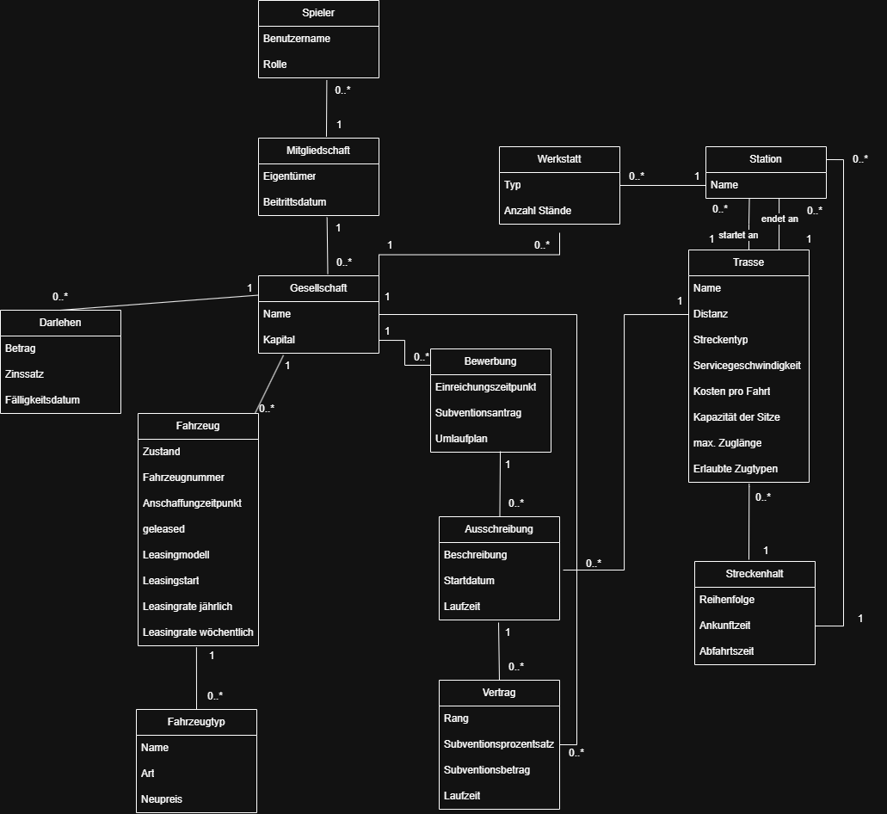

= Glossar

== Einführung
In diesem Dokument werden die wesentlichen Begriffe aus dem Anwendungsgebiet der Webanwendung BahnPlan definiert. Es richtet sich an alle Projektbeteiligten und dient als gemeinsame Referenz, um ein einheitliches Verständnis der verwendeten Begriffe sicherzustellen. Zur besseren Übersichtlichkeit sind Begriffe, Abkürzungen und Datendefinitionen gesondert aufgeführt.

== Begriffe
[%header]
|===
| Begriff | Definition und Erläuterung | Synonyme

| Ausbesserungswerk
| Ein Ausbesserungswerk ist eine spezialisierte Werkstätte für schwere und tiefgreifende Instandhaltungsarbeiten an Schienenfahrzeugen. Hier erfolgen Hauptuntersuchungen, umfangreiche Reparaturen, Unfallinstandsetzungen sowie Modernisierungen.
| AW

| Ausschreibung
| Eine Ausschreibung ist eine Aufforderung, sich um den Betrieb einer Trasse zu bewerben. Die Spieler reichen dafür Fahr- und Umlaufpläne ein.
|

| Besucher
| Eine Person, die BahnPlan aufruft und erkundet ohne sich anzumelden.
| 

| Betriebswerk
| Ein Betriebswerk ist eine betriebsnahe Einrichtung, in der Züge für den täglichen Einsatz vorbereitet werden. Dazu gehören Reinigung, Versorgung, Entsorgung, kleine Wartungen und schnelle Störungsbehebungen, um Fahrzeuge kurzfristig wieder einsatzbereit zu machen.
| BW

| Fahrplan
| Ein Fahrplan legt die Abfahrts- und Ankunftszeiten eines Zuges an allen Haltestellen einer Trasse fest.
|

| Gesellschaft
| Eine Gesellschaft ist ein vom Spieler gegründetes und verwaltetes Eisenbahnunternehmen. Sie umfasst alle Fahrzeuge und das Kapital, die dem Spieler zur Verfügung stehen und bildet die Grundlage für die Teilnahme an Ausschreibungen.
| Bahngesellschaft

| Spieler
| Eine Person, die sich auf der Seite angemeldet hat und am Spiel teilnimmt.
| Nutzer

| Trasse
| Eine Trasse ist eine Schienenstrecke zwischen zwei Orten, mit allen dazugehörigen Haltestellen.
|

| Triebfahrzeug
| Ein Triebfahrzeug ist ein Schienenfahrzeug, das keine oder nur eine geringe Personenkapazität besitzt, jedoch über ausreichend Zugkraft verfügt, um mehrere Wagen oder Güterladungen zu ziehen oder zu schieben.
| Lok, Tfz

| Umlaufplan
| Ein Umlaufplan regelt den zeitlichen Einsatz und die Abfolge der Fahrzeuge einer Gesellschaft auf den betriebenen Trassen.
|

| Wagen
| Ein Wagen ist ein Schienenfahrzeug, das zum Transport von Personen dient und an ein Triebfahrzeug angehängt wird, um von diesem gezogen oder geschoben zu werden.
|

|===

== Abkürzungen und Akronyme
[%header]
|===
| Abkürzung | Bedeutung | Erläuterung

| AW | Ausbesserungswerk | siehe Begriffe

| BW | Betriebswerk | siehe Begriffe

| ew | eigenwirtschaftlich | Wird in Verbindung mit den Trassen benutzt, um diese als eigenwirtschaftlich betrieben zu kennzeichen.

| Kat | Kategorie | Die Kategorie teilt die Ausschreibungen in drei Schwierigkeitsgrade ein.

| sv | subventioniert | Wird in Verbindung mit den Trassen benutzt, um diese als durch BahnPlan subventioniert zu kennzeichen.

| Tfz | Triebfahrzeug | siehe Begriffe
|===

== Verzeichnis der Datenstrukturen
[%header]
|===
| Bezeichnung | Definition | Format | Gültigkeitsregeln | Aliase

| Anmeldedaten
| Zusammensetzung von Benutzername/ E-Mail und Passwort.
| String
|
| Login

| Ausschreibung
| Eine Ausschreibung zum Betrieb einer Trasse mit Beschreibung, Startdatum, Laufzeit in Wochen sowie Angaben zum Takt und den Servicezeiten.
| Integer, String, Date
| Muss einer Trasse zugeordnet sein.
| tenders

| Benutzer
| Ein registrierter Nutzer der Plattform mit E-Mail, Benutzername, Rolle und Aktivitätsstatus.
| Integer, String, Boolean, Timestamp
|
| users

| Bewerbung
| Eine Bewerbung einer Gesellschaft auf eine Ausschreibung, bestehend aus dem Einreichungszeitpunkt, dem beantragten wöchentlichen Subventionsbetrag sowie einem hinterlegten Dokument wie einem Umlaufplan.
| Integer, Timestamp, String
| Muss einer Ausschreibung und einer Gesellschaft zugeordnet sein.
| tender_bid

| Darlehen
| Ein Kredit einer Gesellschaft mit Ursprungsbetrag, verbleibendem Betrag, wöchentlichem Zinssatz und Fälligkeitsdatum. Gibt außerdem an, ob es sich um einen Überziehungskredit handelt.
| Integer, Double, Date, Boolean, Timestamp
| Muss einer Gesellschaft zugeordnet sein.
| loans

| Fahrzeug
| Ein konkretes Schienenfahrzeug im Besitz einer Gesellschaft. Enthält Angaben zu Typ, Zustand in Prozent, Anschaffungszeitpunkt sowie Leasingdetails, falls das Fahrzeug geleast ist.
| Integer, Double, Boolean, Date, Timestamp, String
| Muss einem Fahrzeugtyp und einer Gesellschaft zugeordnet sein.
| vehicles

| Fahrzeugtyp
| Eine Vorlage für Fahrzeuge mit festgelegten Eigenschaften wie Name, Art, Neupreis, Kilometerkosten und Energiebasiskosten.
| Integer, String, Double
|
| vehicle_types

| Gesellschaft
| Ein Eisenbahnunternehmen mit eigenem Namen und Kapital. Kann einer übergeordneten Gesellschaft angehören.
| Integer, String, Timestamp
|
| companies

| Gesellschaftsmitgliedschaft
| Verknüpfung zwischen einem Benutzer und einer Gesellschaft; gibt an, ob der Benutzer Eigentümer ist und wann er der Gesellschaft beigetreten ist.
| Integer, Boolean, Timestamp
| Muss einem Benutzer und einer Gesellschaft zugeordnet sein.
| company_user_link

| Station
| Eine Haltestelle mit einem eindeutigen Namen, die als Start, Ende oder Zwischenstopp einer Trasse dient.
| Integer, String
|
| stations

| Streckenhalt
| Ein einzelner geplanter Halt auf einer Trasse, mit Ankunfts- und Abfahrtszeiten in beide Richtungen sowie der Position in der Reihenfolge der Halte.
| Integer, Double, Time, UUID
| Muss einer Trasse zugeordnet sein.
| route_stops

| Tochtergesellschaft
| Ergänzende Angaben zu einer Gesellschaft, bestehend aus einem internen Code, einer Risikoklassifizierung und optionalen Notizen.
| Integer, String
| Muss einer Gesellschaft zugeordnet sein.
| subsidiary_details

| Trasse
| Eine Schienenstrecke zwischen zwei Stationen mit allen streckenbezogenen Eigenschaften wie Distanz, Geschwindigkeit, Zuglänge und Kostenangaben. Gibt außerdem an, welche Zugtypen auf der Strecke erlaubt sind.
| Integer, String, Double, Boolean, UUID
| Start- und Endstation sind im ERD als Fremdschlüssel auf stations hinterlegt.
| routes

| Vertrag
| Das Ergebnis einer erfolgreichen Bewerbung. Enthält Ranginformation, Subventionsprozentsatz, wöchentlichen Subventionsbetrag sowie Angaben zu automatischer Verlängerung und möglicher Kündigung.
| Integer, Double, Date, Boolean, Timestamp
| Muss einer Ausschreibung und einer Gesellschaft zugeordnet sein.
| contracts

| Werkstatt
| Eine Einrichtung zur Fahrzeugwartung, die einer Station und einer Gesellschaft zugeordnet ist. Enthält Angaben zu Typ, Anzahl der Wartungsplätze und Bauzeitpunkt.
| Integer, String, Timestamp
| Muss einer Station und einer Gesellschaft zugeordnet sein.
| workshops
|===

== Domänenmodell
[%header]

//Abbildung

